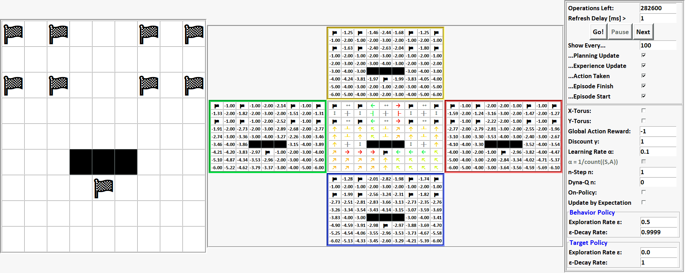

# RLproject2020

### Requirements

You need python 3.9 to run at the moment. Using Conda you can create a environment with Python 3.9 by running.

```shell
conda create -n py39 python=3.9
conda activate py39
pip install -r requirements.txt
```

### Getting the Code

```sh
git clone https://github.com/alexschroeter/RLproject2020 
cd RLproject2020
```

### Running the Program

Run:

```bash
python main.py --grid-shape 9 --steps 1000000 --refresh-rate 1 --show-rate 100 --off-policy --grid-world-template 15
```

which will result in:



### Flow control explanation:

In the upper right, you see an entry named “Show Every…”, followed by five checkboxes, one for each possible operation the agent can perform (“...Experience Update”, “...Action Taken”, “...Episode Finished”, etc). They define which operations will be visualized and which not as follows:
Each time any of the marked operations is performed, an internal counter is incremented. If this counter reaches the number set in the “Show Every…”-entry, a visualization happens, then the counter is reset to zero.
The counter is also reset to zero at any time you change that number or toggle any of the operation flags.

To clarify, “Experience update” means any update of any state-action-value that is NOT made by planning. “Planning Update” then obviously means the opposite.
Planning isn’t implemented yet, but up next.

With each visualization, every state-action-value that changed *since the last visualization* will be colored (red for decrease, green for increase). This feature really shines if you set n-Step to a higher n or to < 1 (which toggles every-visit MC), since you will exactly see the delayed updates happening.
Also the current agent position will now be visualized in each of the six grids, making it way easier to comprehend value updates.

If you just click “Go!”, the visualizations will happen one after another in time intervals defined by the “Refresh Delay [ms]”-entry. Everything that must not be visualized in between happens as fast as possible. If you then click “Pause”, the flow and the learning algorithm will freeze in the moment represented by the current visualization. Everytime the flow is frozen (or just not started yet) you can click “Go!” to continue in the way described above, or you can click “Next” to proceed by exactly one visualization, then automatically freeze again.

At any time when the flow is frozen as the Agent just finished an Episode, meaning it disappeared after it reached a goal and performed all remaining updates, you may change the environment the same way as you did before you initially clicked “Go!”. You can easily focus on this states by marking only the “...Episode Finish” checkbox.

Once the number set in “Operations Left” has reached zero, the flow will immediately end, produce plots and kill the agent. You can then optionally modify the environment and start a new run with a new agent by just setting “Operations Left” to a number greater than zero and restarting the flow.


### Known bugs:
- If you change any entry to be empty during a non-frozen flow, the program will most likely crash or at least result in undefined behavior. This is not going to be fixed, just watch out that you only empty any entry while the flow is paused.
- A very small epsilon will be displayed in scientific notation with tons of decimal places, so once the value falls below 0.0001 = 1e-4, it will appear like an arbitrary number randomly changing between 1 and 10, since the e-term doesn’t fit inside the entry anymore. Due to the nature of the used library and the own code architecture, I don’t think there exists a clean fix for this.

Not solved yet:
- In rare cases, after clicking “Pause” when only “...Episode Finished” is marked, you are not able to update the environment during the freeze. Then, after Clicking “Next” once, you are able again.
- In rare cases, the plotting after a run takes extraordinary long and may cause the program to crash.
